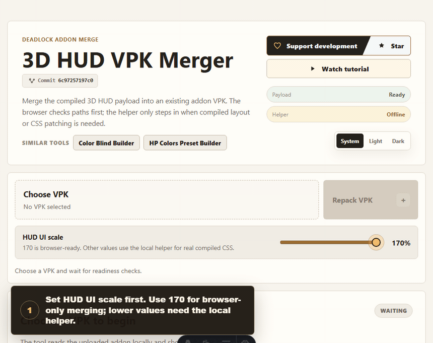

# 3D HUD VPK Merger

Merge the compiled 3D HUD payload into a locally selected Deadlock addon VPK. Files stay on your machine.

The tool reads the selected VPK locally in the browser. Simple non-conflicting merges happen fully client-side. Supported layout and CSS conflicts can be patched through the optional local compiler helper.

## Demo



## Run Locally

```bash
npm install
npm run dev
```

Open `http://127.0.0.1:4328/3d-hud-web-merger/` or the port Astro prints.

For VPKs that need compiled layout or CSS patching, run the helper in a second terminal:

```bash
npm run helper
```

The helper listens only on `127.0.0.1` and allows the GitHub Pages origin by default.

## Payload Refresh

The bundled payload is generated from the latest `main/3d hud` source in:

```text
https://github.com/Hantu-Raya/Deadlock-mods-collection/tree/main/3d%20hud
```

Refresh it locally with the Source 2 compiler wrapper available:

```bash
npm run payload:sync
```

The refresh command downloads the latest raw HUD source, minifies `panorama/scripts/3d_hero_dynamic.js` with Terser, compiles the raw files into `_c` payload files, and records the upstream commit in `public/payload/3d-hud/manifest.json`.

## GitHub Pages

This repo is configured for project Pages at:

```text
https://hantu-raya.github.io/3d-hud-web-merger/
```

In the GitHub repository settings, set Pages to **GitHub Actions**. The included workflow builds and deploys `dist` on pushes to `main`.

## Verification

```bash
npx -y react-doctor@latest . --json --offline
npm run check
node --check scripts/local-compiler-helper.mjs
```

To regenerate the README demo GIF while the local dev server is running:

```bash
npm run demo:gif
```

## Notes

- VPK files are processed locally; the web app does not upload them to a server.
- The hosted GitHub Pages app can still use the local compiler helper when it is running on the user's machine.
- This is an unofficial fan-made tool and is not affiliated with Valve.

## License

MIT. See `LICENSE` and `NOTICE.md`.
